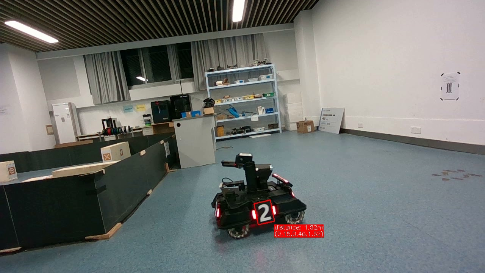
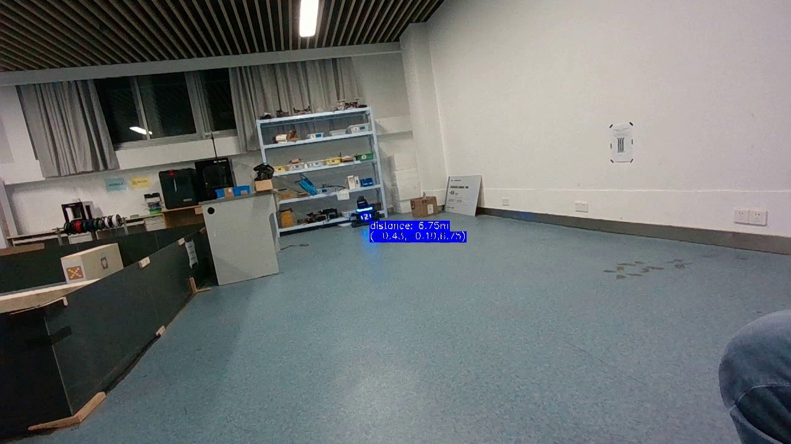

# rs-armor-detector
RealSense 装甲板识别示例

> 本示例使用了东南大学的开源装甲板识别方案（[SEU-SuperNova-CVRA/Robomaster2018-SEU-OpenSource](https://github.com/SEU-SuperNova-CVRA/Robomaster2018-SEU-OpenSource)），其相关代码位于 `src/seu-detect` 下。

## 效果展示



## 构建
构建依赖：
* OpenCV 4
* librealsense2
  * Linux 下安装可参考 [RealSense 官方教程](https://github.com/IntelRealSense/librealsense/blob/master/doc/distribution_linux.md)，需要安装 `librealsense2-dev` 包

克隆仓库后执行：
```sh
cd build
cmake ..
make
```

随后运行 `build` 目录下的 `rs-armor-detector` 文件即可。
